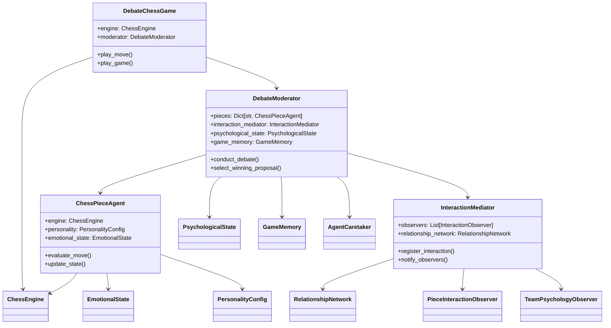

#### for windows: python tools\fancy.py -cmd "python sunfish.py"

Chess Debate System

A playful project that explores social dynamics and narrative generation through the lens of chess. At its heart is a highly extensible personality system where chess pieces, each with their own character and emotional state, debate and interact while playing chess. The system is designed for rich storytelling and dynamic relationships rather than strong chess play, making it an ideal platform for experimenting with character-driven gameplay and social simulation.

The architecture emphasizes modularity and extensibility, particularly in its personality system. New personalities, interaction types, and debate strategies can be easily plugged in, allowing for endless variations in how pieces behave and interact. The project includes integration points for large language models (LLMs) to further enhance character development and narrative generation.

Dependencies are minimal - currently requires only python standard/core libararies and common LLM sdks.

## Core Architecture

The system is built around a rich debate-driven move selection process where chess pieces, each with their own personality and emotional state, discuss and propose moves. The game maintains complex relationship networks and psychological states that evolve based on game events.

### Key Components

1. **DebateChessGame** (Main Orchestrator)
   - Manages game flow and state
   - Coordinates debates and move selection
   - Handles player interaction
   - Records game history and PGN output
   - Visualizes psychological and emotional states

2. **Debate System**
   - **DebateModerator**: Orchestrates debates and manages piece interactions
   - **InteractionMediator**: Manages piece relationships and observations
   - **PieceAgents**: Individual pieces with personalities, emotional states, and move evaluation
   - **RelationshipNetwork**: Tracks trust and cooperation between pieces

3. **State Management**
   - **PsychologicalState**: Team-level psychological metrics
   - **EmotionalState**: Individual piece emotions
   - **GameMemory**: Records significant moments and interactions
   - **AgentMemento/Caretaker**: Preserves and restores piece states

4. **Chess Engine**
   - Basic position evaluation focused on supporting character interactions
   - Simple tactical pattern recognition (blocks, forks, threats, etc.)
   - Move validation and game state management
   - Note: This is an intentionally simplified chess engine, designed to support the social simulation rather than provide strong chess play

### Core Game Flow

1. **Initialization**
   ```
   DebateChessGame
   ├── Creates and initializes factories, the chess engine, and shared board
   ├── Initializes DebateModerator
   │   ├── Creates piece personalities
   │   ├── Initializes piece agents
   │   └── Sets up relationship network
   └── Prepares game state and PGN recording
   ```

2. **Move Selection Process**
   ```
   play_move()
   ├── Get legal moves
   ├── Conduct debate
   │   ├── Pieces evaluate moves independently
   │   ├── Generate proposals with arguments
   │   └── Consider psychological and chess factors
   ├── Display proposals and impacts
   ├── Player selects winning move
   ├── Update relationships and emotional states
   └── Record move and effects, update game state
   ```

3. **State Updates**
   ```
   After Move Selection
   ├── Update piece positions
   ├── Notify observers
   │   ├── Update emotional states
   │   ├── Update psychological state
   |   ├── Record interactions
   |   ├── Update relationship network
   │   └── Record game memory
   └── Save state snapshot
   ```

## Core Systems

### DebateModerator

The central coordinator of the debate and interaction system:

- Orchestrates debates between pieces using configurable strategies
- Manages game state and piece positions
- Coordinates relationship updates through InteractionMediator
- Tracks debate history and game memory
- Maintains team psychological state
- Uses Memento pattern for state management

### ChessPieceAgent

Base class for all chess pieces with rich personality-driven behavior:

- Evaluates moves based on both tactical and emotional factors
- Maintains individual emotional state (confidence, morale, trust, aggression)
- Generates personality-driven arguments for moves
- Tracks interactions with other pieces
- Responds to game events through observers

### Interaction System

#### InteractionMediator
- Manages piece relationships and trust networks
- Coordinates observers for game events
- Tracks and processes piece interactions
- Updates relationship metrics

#### RelationshipNetwork
- Maintains trust matrix between pieces
- Tracks recent interactions and cooperation
- Provides support bonuses based on relationships
- Influences move evaluation and debates

### State Management

Comprehensive tracking of game state and evolution:

#### PsychologicalState
- Team-level metrics (cohesion, morale, coordination, leadership)
- Simulates psychological impact of moves
- Influences debate outcomes
- Provides feedback for move selection

#### GameMemory
- Records significant game moments (captures, checks, harassment, etc.)
- Tracks emotional triggers (threats, captures, etc.)
- Maintains narrative threads
- Influences future interactions at both team and individual levels

### Chess Engine

Position evaluation and move analysis:

- (Somewhat) detailed tactical analysis (captures, checks, discoveries)
- Position evaluation with multiple components
- Move context analysis
- Pattern recognition for tactical opportunities

### Visualization System

Rich display of game state and interactions:

- Debate proposals with personality-appropriate emojis
- Emotional state visualization with progress bars
- Relationship network display
- Move impact analysis with tactical and psychological factors
- PGN recording with debate metadata

Core Systems
DebateModerator

    Orchestrates debates between pieces
    Manages game state
    Coordinates relationship updates
    Tracks debate history

ChessPieceAgent

    Base class for all pieces
    Handles move evaluation
    Maintains personality and emotional state
    Generates move proposals

Relationship System

    InteractionMediator: Coordinates piece interactions
    RelationshipNetwork: Tracks trust and cooperation
    PieceInteractionObserver: Updates piece emotional states

Factory System
PersonalityFactory

    Creates piece-specific personalities
    Manages personality templates
    Handles themed variations

PieceAgentFactory

    Creates concrete piece agents
    Initializes piece states
    Maps piece types to agent classes

Future LLM Integration Points
CharacterInferenceEngine

    Evolves personalities based on game history
    Generates character-appropriate responses
    Interprets game moments

DebateExtension

    Enriches basic arguments
    Generates debate dynamics
    Handles inter-character interactions

NarrativeInferenceEngine

    Creates character arcs
    Interprets game history
    Generates narrative elements

Orchestrator

    Coordinates LLM interactions
    Processes game moments
    Updates psychological states

Debate Flow

    Main loop gets legal moves
    Moderator initiates debate
    Pieces evaluate moves and generate proposals
    Moderator collects and ranks proposals
    Player selects winning proposal
    Relationship network updated
    Piece emotional states updated
    Game memory recorded

Relationship Update Flow

    Interaction occurs (move made)
    InteractionMediator notified
    Relationship network updated
    PieceInteractionObservers notified
    Piece emotional states updated
    Game memory updated

Future LLM Integration Flow

    Game moment occurs
    Orchestrator processes moment
    CharacterInferenceEngine evolves personalities
    DebateExtension enriches arguments
    NarrativeEngine generates story elements
    Updates fed back to core systems

Sequence Diagram: Main Game and Debates

sequenceDiagram
    participant Main
    participant DebateModerator
    participant ChessPiece
    participant ChessEngine
    participant InteractionMediator
    participant RelationshipNetwork

    Main->>DebateModerator: play_move()
    DebateModerator->>ChessEngine: get_legal_moves()
    ChessEngine-->>DebateModerator: legal_moves[]
    
    loop For each relevant piece
        DebateModerator->>ChessPiece: evaluate_move(position, move)
        ChessPiece->>ChessEngine: analyze_position()
        ChessEngine-->>ChessPiece: analysis
        ChessPiece-->>DebateModerator: MoveProposal
    end

    DebateModerator->>Main: display_proposals()
    Main->>DebateModerator: select_winning_proposal(choice)
    
    DebateModerator->>InteractionMediator: register_interaction()
    InteractionMediator->>RelationshipNetwork: update_relationships()
    
    par Notify Observers
        InteractionMediator->>PieceInteractionObserver: on_relationship_change()
        PieceInteractionObserver->>ChessPiece: update_emotional_state()
    end

Class Diagram

classDiagram
    class DebateModerator {
        +pieces: Dict[str, ChessPieceAgent]
        +interaction_mediator: InteractionMediator
        +psychological_state: PsychologicalState
        +conduct_debate()
        +select_winning_proposal()
    }

    class ChessPieceAgent {
        +engine: ChessEngine
        +personality: PersonalityConfig
        +emotional_state: EmotionalState
        +evaluate_move()
        +_analyze_interaction()
    }

    class InteractionMediator {
        +observers: List[InteractionObserver]
        +relationship_network: RelationshipNetwork
        +register_interaction()
        +notify_observers()
    }

    class PieceInteractionObserver {
        +piece: ChessPieceAgent
        +relationship_network: RelationshipNetwork
        +on_game_moment()
        +on_relationship_change()
    }

    class RelationshipNetwork {
        +trust_matrix: Dict
        +recent_interactions: List
        +get_support_bonus()
        +get_recent_cooperation()
    }

    class PersonalityFactory {
        +templates: Dict
        +create_personality()
        +create_themed_personality()
    }

    class PieceAgentFactory {
        +AGENT_TYPES: Dict
        +create_agent()
        +create_all_agents()
    }

    DebateModerator --> ChessPieceAgent
    DebateModerator --> InteractionMediator
    InteractionMediator --> RelationshipNetwork
    InteractionMediator --> PieceInteractionObserver
    PieceInteractionObserver --> ChessPieceAgent
    ChessPieceAgent <-- PieceAgentFactory
    ChessPieceAgent --> PersonalityFactory

    class ConcreteAgents {
        <<interface>>
    }
    ConcreteAgents --|> ChessPieceAgent
    note for ConcreteAgents "KnightAgent\nBishopAgent\nRookAgent\nQueenAgent\nKingAgent\nPawnAgent"

Sequence Diagram: Initialization Flow

sequenceDiagram
    participant Main
    participant DebateModerator
    participant PieceAgentFactory
    participant PersonalityFactory
    participant ChessPiece

    Main->>DebateModerator: create_default()
    DebateModerator->>PersonalityFactory: create_all_personalities()
    PersonalityFactory-->>DebateModerator: personalities

    loop For each piece type
        DebateModerator->>PieceAgentFactory: create_agent(type, personality)
        PieceAgentFactory->>ChessPiece: initialize(personality)
        ChessPiece-->>PieceAgentFactory: agent
        PieceAgentFactory-->>DebateModerator: agent
    end

    DebateModerator-->>Main: moderator

## Character System

The project features a rich and customizaable character system where each chess piece has a distinct personality that influences their chess move selection, debate style, and emotional state. Included default personalities:

### Personality Types

- **Queen**: Dramatic and mood-swinging, alternating between confidence and self-doubt
- **King**: Anxious leader masking fear with theoretical proclamations
- **Bishop**: Religious zealot seeing the board as a conversion opportunity
- **Knight**: Quixotic adventurer viewing moves as noble quests
- **Rook**: Fortress-dwelling defender with occasional berserker moments
- **Pawn**: Revolutionary secretly dreaming of promotion and power

### Emotional States

Each piece maintains emotional states that influence their decisions:
- **Confidence**: Affects risk-taking in moves
- **Morale**: Influences evaluation weights
- **Trust**: Determines cooperation bonuses
- **Aggression**: Balances tactical vs positional play

### Interaction Types

Pieces can interact in various ways:
- **Support**: Protecting or backing up other pieces
- **Cooperation**: Working together in tactics
- **Sacrifice**: Giving up material for team benefit
- **Competition**: Arguing for different plans or advantageous positions
- **Trauma**: Responding to captures or threats

## Usage

1. **Setup**
   ```bash
   # Clone the repository
   git clone https://github.com/yourusername/chessy.git
   cd chessy

   # Create and activate virtual environment
   python -m venv .venv
   source .venv/bin/activate  # On Windows: .venv\Scripts\activate

   # Install dependencies
   pip install -r requirements.txt
   ```

2. **Running the Game**
   ```bash
   python main.py
   ```

3. **Gameplay**
   - White pieces will debate their moves
   - Each piece provides arguments based on their personality
   - You choose which piece's proposal to follow
   - Watch relationships and emotional states evolve
   - Play against the engine or player as Black

4. **Game Output**
   - Debate proposals with personality-driven arguments
   - Emotional state visualizations
   - Relationship network updates
   - Move impact analysis
   - PGN game record with debate history

## Development

The project is designed from the ground up for extensibility, with multiple plug-and-play components:

1. **Personality System**
   - Extend `PersonalityFactory` with new templates
   - Create themed personality sets (e.g., historical figures, literary characters)
   - Define new personality traits and interaction styles
   - Add custom emotional triggers and responses
   - Implement new debate strategies per personality type

2. **Interaction System**
   - Add new interaction types to `InteractionType`
   - Create custom relationship metrics
   - Implement new observation patterns
   - Define new emotional impact rules
   - Add custom narrative generation for interactions

3. **Debate System**
   - Implement new debate strategies in `DebateStrategy`
   - Create custom proposal ranking systems
   - Add new argument generation patterns
   - Define specialized debate rules for different game phases
   - Implement themed debate formats

4. **State Management**
   - Add new psychological metrics
   - Create custom state persistence patterns
   - Implement new memory systems
   - Define new ways to evolve relationships
   - Add custom state visualization methods

5. **Future LLM Integration**
   - Character inference from game history
   - Dynamic personality evolution
   - Rich narrative generation
   - Advanced debate arguments
   - Emotional state prediction
   - Relationship dynamic modeling

Each component is designed with clear interfaces and extension points, making it easy to experiment with new ideas while maintaining the core game mechanics.

## System Interactions

### Main Game Flow


### Initialization Flow


### Class Relationships
